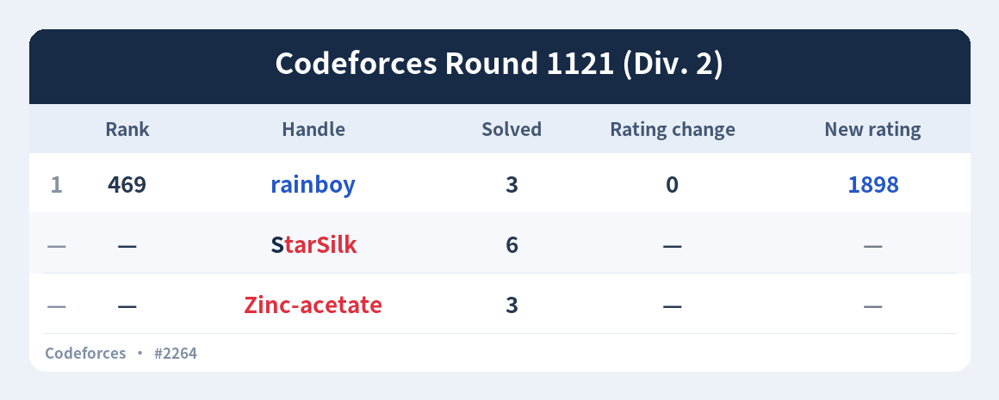
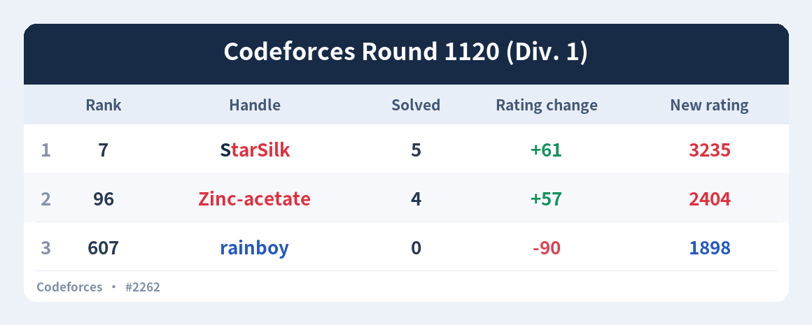

# Codeforces Helper 1.3.4 赛后战报验收

日期：2026-09-16。开发基线：`da65a2ffe306bbc29e6c61c54a22d3470fca07d3`（v1.3.3）。

适用版本：1.3.4。赛后战报与修正版图片已确认，用户已授权提交推送小版本更新。本文记录最终行为、样例和验证边界；第一版预览的 Rank 口径及“1121 只有 rainboy 参赛”的结论已撤回。

发布前复验结果及终稿文件哈希见 [release-1.3.4.json](release-1.3.4.json)。先前修正版的功能验收快照保留在 [acceptance.json](acceptance.json)，其中等待确认的状态仅代表当时阶段。

## 功能与配置

- AstrBot 配置新增 `contest_report`，`enabled` 默认 `false`。
- 抓取与数据更新共用现有周期，先同步过题及 Rating，再检查战报。每轮最多核查 8 场候选，优先近期比赛，旧候选保留续查；不以开赛时间直接丢弃迟出分比赛。
- 根据官方 `ratingUpdateTimeSeconds` 与持久化启用时间比较。热重载保留起点，关闭取消积压，再次开启重新起算；已保存的同场快照不会重复创建。
- `immediate` 在检测到出分并完成图片后发送；`scheduled` 在北京时间每天 `send_time` 发送。发送群可独立配置，留空沿用 `/acm set group`。
- 包含 `CONTESTANT` 与 `OUT_OF_COMPETITION` 的现场参赛记录，排除 `PRACTICE`、`VIRTUAL` 和管理者测试提交。
- 有出分记录的成员按个人参赛页的 Rank 升序排列。未计分成员统一置后，按 Solved 降序排列；他们的序号、Rank、Rating change、New rating 均为 `—`，Solved 显示实际数量。
- 序号列不显示表头，其余表头严格为 `Rank`、`Handle`、`Solved`、`Rating change`、`New rating`。计分成员实际零涨跌显示 `0`。
- 同一周期发现多场比赛时，逐场存档、逐场发送。没有本地成员现场参赛数据时不发送，保留空快照用于核对。
- 人数超过 40 时自动分页。发送确认按比赛、群、页保存，失败后只重试未确认部分；现有一分钟设置检查任务会继续处理已到期记录。
- 每场快照独立保存历史 Rank、Solved、old/new Rating 和涨跌。成员当前 Rating 通过 `user.info` 刷新，避免旧场次的新分数覆盖账号更晚的当前分数。

## 修正版功能验收结果

| 项目 | 结果 |
| --- | --- |
| Python 全量回归 | **116 项通过，0 失败，0 错误，0 跳过**；开启 `-W error`；耗时 135.520 秒 |
| 赛后战报新增用例 | 共 33 项，包含两场实际响应及官网核对结果，覆盖未计分参赛、Rank 来源、末尾排序和四列横线、完整分页及失败保留 |
| 前端回归 | 前一轮 5 项通过，本次未修改前端脚本 |
| Python 编译及配置 JSON | 24 个 Python 文件编译通过，配置 JSON 解析通过 |
| Git 空白检查 | `git diff --check` 通过 |
| 实网预览 | 请求三人的 `user.rating` 和完整比赛时间窗口 `user.status`，另读取比赛元信息及出分状态；使用与正式发送相同的表格渲染器 |
| 图片核对 | 两张 PNG 均已目视检查，标题、空白序号表头、六列、排序、涨跌符号与已保存官方数据一致 |

自动化测试使用真实 SQLite、Quart、Pillow、APScheduler 和 Windows 文件锁；宿主与 QQ 发送使用替身。此次未在真实 AstrBot/QQ 实例或 Linux 实机上联调，也没有向真实 QQ 群发送预览。

## 预览数据

三人最近共同参赛的比赛是 **Codeforces Round 1121 (Div. 2)，contest 2264**。其中 StarSilk 与 Zinc-acetate 不计 Rating：

| 序号 | Rank | Handle | Solved | Rating change | New rating |
| --- | --- | --- | --- | --- | --- |
| 1 | 469 | rainboy | 3 | 0 | 1898 |
| — | — | StarSilk | 6 | — | — |
| — | — | Zinc-acetate | 3 | — | — |



前一场 **Codeforces Round 1120 (Div. 1)，contest 2262** 同步修正 Rank 为 7、96、607：



已通过浏览器打开三人的官方个人 Contests 页并选择 `All`，逐项核对 Rank、Solved 与分数。Rank 使用 `user.rating` 中与这些个人页面一致的名次。受限公共 standings 返回的 330、4、90、599 不再用于战报 Rank；未计分成员没有个人出分名次，不推算或伪造名次。

第一版只接受 `CONTESTANT`，遗漏了两位 `OUT_OF_COMPETITION` 成员，且误用受限榜单 Rank。新增真实数据回归在修复前分别复现“少了 StarSilk、Zinc-acetate”和“330 != 469”；修复后通过。实际响应精选样本与官网核对的预期值保存在 [测试数据](../../tests/fixtures/contest_reports_2262_2264.json)。

后端仍使用公开 API，不依赖浏览器登录。完整获取每位成员的个人评级历史、比赛时间窗口内的提交；多场比赛共享这次查询。请求失败时不把缺失数据当成未参赛。官网个人页用于本轮人工交叉核对，原始字段与精选快照见 [preview-data.json](preview-data.json)。历史预览不写入生产库或改变启用边界。

核对页面：[StarSilk](https://codeforces.com/contests/with/StarSilk?type=all)、[Zinc-acetate](https://codeforces.com/contests/with/Zinc-acetate?type=all)、[rainboy](https://codeforces.com/contests/with/rainboy?type=all)。接口依据：[user.rating](https://codeforces.com/apiHelp/methods#user.rating)、[user.status](https://codeforces.com/apiHelp/methods#user.status)、[OneBot 图片消息段](https://github.com/botuniverse/onebot-11/blob/master/message/segment.md#图片)。

## 复验与重绘

发布检查（全量测试、已确认图片重绘一致性、编译、配置与本地文档链接）：

```text
python -X utf8 -B review/2026-09-16/verify_release.py
```

单独执行测试或重新获取官方数据：

```text
python -X utf8 -B -W error -m unittest discover -s tests -v
node --test --test-reporter=tap tests/test_frontend.cjs
python -X utf8 -B review/2026-09-16/make_preview.py
```

仅重绘已保存数据、保持当次内容不变：

```text
python -X utf8 -B review/2026-09-16/make_preview.py --cached
```

README 已同步版本、独立开关、发送配置、未计分排序与横线显示、历史快照保存及升级方式；插件元数据、版本日志、结构文档和根验收入口同步更新。发布复验不重新拉取官方数据，确保发布图与已确认预览完全一致。
